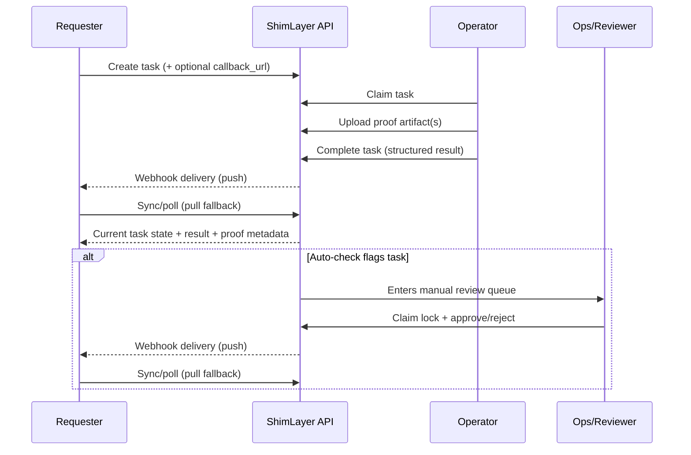

# ShimLayer User Journey (MVP)

This doc describes the end-to-end path in simple, user-facing terms.

## Roles
- **Requester**: Your product/workflow that creates tasks and receives results.
- **Operator**: Human who resolves tasks and attaches proof.
- **Ops/Reviewer**: Oversees safety, refunds, and manual review queue.

## Happy Path (No Manual Review)
1. **Requester creates a task** (`stuck_recovery` or `quick_judgment`), optionally with a `callback_url`.
2. **Operator claims** the task.
3. **Operator uploads proof** (recommended: upload a local artifact) and **completes** the task with a structured result.
4. **Requester receives the result**:
   - **Push**: webhook delivery to `callback_url` (best for latency).
   - **Pull fallback**: Requester UI/API can poll task state and/or sync the task list (best for reliability).

## Safety Path (Auto-check → Manual Review Queue)
1. Task completes and the server runs an **auto-check** (with optional PII redaction before provider calls).
2. If flagged, the flow enters **Manual review**.
3. A reviewer claims a lock, then **Approve/Reject**.
4. Requester sees review outcome via webhook (push) and/or sync/poll (pull).

## Push + Pull (Hybrid Delivery Model)
- **Push** gives near real-time updates but can fail due to receiver downtime, network errors, or signature validation issues.
- **Pull** ensures the Requester can always converge to the correct state even if webhook delivery is delayed or fails.

### Recommended Requester strategy
- Use webhook deliveries for instant updates.
- Run a background **sync loop** to keep the task list consistent.
- When a task is active (queued/claimed), run an **active-task poll** with backoff.

## Sequence (High-level)

